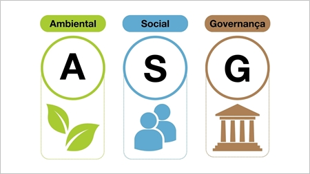

# ¿Que significan las siglas ASG?

**A***mbientales*
**S***ociales*
**G***obernanza*

Refiriendose a los criterios utilizados para evaluar el desempeño de una empresa en terminos de sostenibilidad.

## La utilidad de el ASG

El ASG tiene como objetivo principal ayudar a las empresas a medir su impacto ambiental y social. 
Tambien a gestionar riesgos y oportunidades,ayudando a identificar riesgos relacionados con la sostenibilidad mientras que aprovenchan las nuevas oportunidades de negocio. 
De esta forma la empresa se construye una reputacion solida, atrayendo inversores y talentos, y asegurando la continuidad del negocio.

##  Los 3 pilares del ASG

* Ambiental: Se centra en el impacto de la empresa en el planeta
  * Reducción de la huella de carbono
  * Economia circular
  * Gestion del agua
* Social: Aborda las relaciones de la empresa con las personas
  * Derechos humanos
  * Diversidad e inclusion
  * Relaciones con la comunidad
* Gobernanza: Se refiere a la estructura y prácticas de gestión de la empresa
  * Transparencia
  * Etica empresarial
  * Prevencion contra la corrupcion

## Beneficios de implementar el ASG

Implementar ASG no solo es una forma de contribuir al bienestar global, sino que también ofrece ventajas tangibles para las empresas. 
Mejorar la reputación, acceder a financiación, reducir riesgos, mejorar la eficiencia, atraer y retener talento, y fomentar la innovación son solo algunos de los muchos beneficios que pueden resultar de adoptar este enfoque. 
A largo plazo, las empresas que integran principios ASG de forma genuina suelen ser más resilientes, sostenibles y competitivas.
