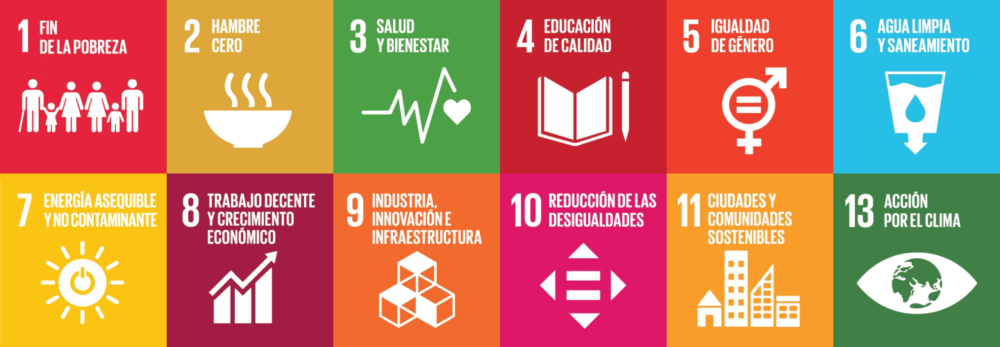

# La agenda 2030 y los ODS

La Agenda 2030 es una iniciativa global adoptada por los países miembros de las Naciones Unidas en septiembre de 2015 con el objetivo de abordar los principales desafíos que enfrenta el mundo, como la pobreza, la desigualdad, el cambio climático, la paz y la justicia, entre otros. 
Esta agenda es un llamado a la acción para promover un desarrollo sostenible que tenga en cuenta las necesidades del presente sin comprometer las capacidades de las futuras generaciones.

El núcleo de la Agenda 2030 son los 17 Objetivos de Desarrollo Sostenible (ODS), que proporcionan un marco integral para alcanzar un futuro más justo, equitativo y sostenible para todos los países y todas las personas. 
Estos objetivos están diseñados para ser alcanzados a nivel global, regional y nacional, y abarcan tres dimensiones clave del desarrollo: económico, social y ambiental.

## Los 17 ODS

 1. Fin de la pobreza
Erradicar la pobreza extrema para todas las personas en el mundo, actualmente medida como aquellas que viven con menos de 1.25 dólares al día.

2. Hambre cero
Poner fin al hambre, lograr la seguridad alimentaria y la mejora de la nutrición, y promover una agricultura sostenible.

3. Salud y bienestar
Garantizar una vida sana y promover el bienestar para todos en todas las edades.

4. Educación de calidad
Asegurar una educación inclusiva, equitativa y de calidad, y promover oportunidades de aprendizaje durante toda la vida para todos.

5. Igualdad de género
Lograr la igualdad de género y empoderar a todas las mujeres y niñas.

6. Agua limpia y saneamiento
Garantizar la disponibilidad y la gestión sostenible del agua y el saneamiento para todos.

7. Energía asequible y no contaminante
Asegurar el acceso a una energía asequible, confiable, sostenible y moderna para todos.

8. Trabajo decente y crecimiento económico
Promover el crecimiento económico sostenido, inclusivo y sostenible, el empleo pleno y productivo, y el trabajo decente para todos.

9. Industria, innovación e infraestructura
Construir infraestructuras resilientes, promover la industrialización inclusiva y sostenible y fomentar la innovación.

10. Reducción de las desigualdades
Reducir la desigualdad en y entre los países.

11. Ciudades y comunidades sostenibles
Lograr que las ciudades y los asentamientos humanos sean inclusivos, seguros, resilientes y sostenibles.

12. Producción y consumo responsables
Garantizar modalidades de consumo y producción sostenibles.

13. Acción por el clima
Tomar medidas urgentes para combatir el cambio climático y sus efectos.

14. Vida submarina
Conservar y utilizar de forma sostenible los océanos, los mares y los recursos marinos.

15. Vida de ecosistemas terrestres
Gestionar de manera sostenible los bosques, combatir la desertificación, frenar y revertir la degradación de la tierra y frenar la pérdida de biodiversidad.

16. Paz, justicia e instituciones sólidas
Promover sociedades justas, pacíficas e inclusivas, proporcionar acceso a la justicia para todos y construir instituciones eficaces, responsables e inclusivas.

17. Alianzas para lograr los objetivos
Fortalecer los medios de implementación y revitalizar la alianza mundial para el desarrollo sostenible.

## Caracteristicas de la agenda 2023

La Agenda 2030 es un plan global adoptado por la ONU en 2015, con 17 Objetivos de Desarrollo Sostenible (ODS) para promover un desarrollo económico, social y ambiental equilibrado. Sus características clave son: aplica a todos los países, busca la inclusión de los más vulnerables, promueve la sostenibilidad a largo plazo, y requiere la colaboración de gobiernos, empresas y sociedad civil. Además, establece una responsabilidad compartida, donde los países más desarrollados deben apoyar a los menos avanzados, y se mide el progreso con indicadores específicos. Su fin es crear un mundo más justo, equitativo y sostenible.
