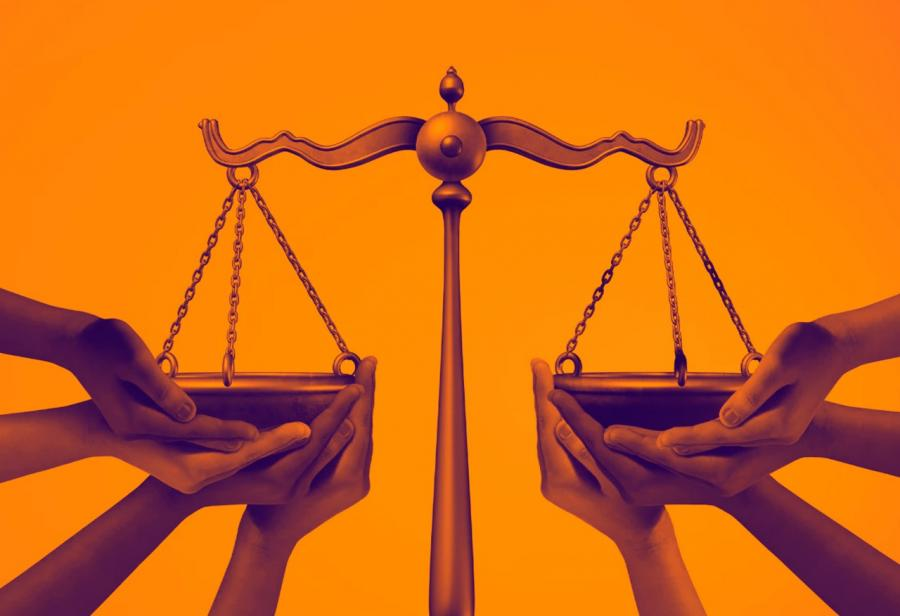

# Sostenibilidad y desarrollo sostenible.
La sostenibilidad y el desarrollo sostenible son conceptos fundamentales en el ámbito de la gestión ambiental, social y económica.Ambos términos están interrelacionados y se centran en la capacidad de satisfacer las necesidades del presente sin comprometer la capacidad de las futuras generaciones para satisfacer sus propias necesidades.
## Sostenibilidad
La sostenibilidad se refiere a la capacidad de mantener procesos, sistemas o estructuras a lo largo del tiempo. Implica un equilibrio entre el crecimiento económico, la equidad social y la protección del medio ambiente. Para lograr una sociedad sostenible, es esencial considerar las interacciones entre estos tres pilares:

* **Económico**: Fomentar un crecimiento económico que no solo sea rentable, sino también inclusivo y responsable. Esto incluye la promoción de prácticas comerciales éticas y el uso eficiente de los recursos.

* **Social**: Asegurar la justicia social y el bienestar de todas las personas. Esto implica eliminar la pobreza, garantizar el acceso a servicios básicos como la educación y la salud, y promover la equidad de género y la inclusión social.

* **Ambiental**: Proteger el medio ambiente y conservar los recursos naturales para las generaciones futuras. Esto incluye la gestión sostenible de los recursos, la reducción de la contaminación y el combate al cambio climático.
## Desarrollo sostenible
El desarrollo sostenible es el proceso mediante el cual se busca el equilibrio entre el crecimiento económico, el bienestar social y la protección del medio ambiente. Este concepto se popularizó con la publicación del Informe Brundtland en 1987, que definió el desarrollo sostenible como "el desarrollo que satisface las necesidades del presente sin comprometer la capacidad de las futuras generaciones para satisfacer sus propias necesidades".
Los principios del desarrollo sostenible se basan en:
* **Integración**: Las decisiones económicas, sociales y ambientales deben estar interconectadas. Las políticas deben considerar los impactos a largo plazo y no solo los beneficios inmediatos.
* **Participación**: La participación de todas las partes interesadas, incluidas las comunidades locales, es crucial para el desarrollo sostenible. Esto asegura que las decisiones reflejen las necesidades y aspiraciones de la sociedad.
* **Equidad**:La sostenibilidad debe garantizar que los beneficios del desarrollo se distribuyan de manera justa, reduciendo las desigualdades y promoviendo la justicia social.
## Importancia de la sostenibilidad y el desarrollo sostenible
La sostenibilidad y el desarrollo sostenible son esenciales para abordar los desafíos globales actuales, como la crisis climática, la pérdida de biodiversidad y la desigualdad social. Fomentar prácticas sostenibles permite:
* **Proteger el Planeta**:Al reducir el impacto ambiental y conservar los recursos naturales, contribuimos a la salud del planeta y a la preservación de ecosistemas vitales.
* **Mejorar la calidad de vida**:La implementación de políticas sostenibles promueve el bienestar social, mejorando la calidad de vida de las comunidades y garantizando un acceso equitativo a recursos y oportunidades.
* **Fomentar la innovación**:La búsqueda de soluciones sostenibles impulsa la innovación y el desarrollo de nuevas tecnologías, lo que puede resultar en nuevas oportunidades económicas.

